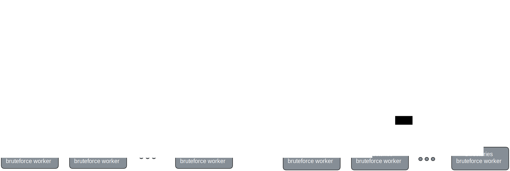

# Enum 📁

<p align="center">

</p>

<!-- table of content -->
<details open="open">
  <summary>Table of Contents</summary>
  <ol>
    <li>
      <a href="#disclaimer">Disclaimer</a>
    </li>
    <li>
      <a href="#features">Features</a>
    </li>
    <li>
      <a href="#installation">Installation</a>
    </li>
    <li>
      <a href="#configuration">Configuration</a>
    </li>
    <li>
      <a href="#usage">Usage</a>
    </li>
    <li>
      <a href="#howitworks">How it works</a>
    </li>
    <li>
      <a href="#license">License</a>
    </li>
  </ol>
</details>

<br>
<br>
<br>

```
EEEEEEEEEEEEEEEEEEEEEENNNNNNNN        NNNNNNNNUUUUUUUU     UUUUUUUUMMMMMMMM               MMMMMMMM
E::::::::::::::::::::EN:::::::N       N::::::NU::::::U     U::::::UM:::::::M             M:::::::M
E::::::::::::::::::::EN::::::::N      N::::::NU::::::U     U::::::UM::::::::M           M::::::::M
EE::::::EEEEEEEEE::::EN:::::::::N     N::::::NUU:::::U     U:::::UUM:::::::::M         M:::::::::M
  E:::::E       EEEEEEN::::::::::N    N::::::N U:::::U     U:::::U M::::::::::M       M::::::::::M
  E:::::E             N:::::::::::N   N::::::N U:::::D     D:::::U M:::::::::::M     M:::::::::::M
  E::::::EEEEEEEEEE   N:::::::N::::N  N::::::N U:::::D     D:::::U M:::::::M::::M   M::::M:::::::M
  E:::::::::::::::E   N::::::N N::::N N::::::N U:::::D     D:::::U M::::::M M::::M M::::M M::::::M
  E:::::::::::::::E   N::::::N  N::::N:::::::N U:::::D     D:::::U M::::::M  M::::M::::M  M::::::M
  E::::::EEEEEEEEEE   N::::::N   N:::::::::::N U:::::D     D:::::U M::::::M   M:::::::M   M::::::M
  E:::::E             N::::::N    N::::::::::N U:::::D     D:::::U M::::::M    M:::::M    M::::::M
  E:::::E       EEEEEEN::::::N     N:::::::::N U::::::U   U::::::U M::::::M     MMMMM     M::::::M
EE::::::EEEEEEEE:::::EN::::::N      N::::::::N U:::::::UUU:::::::U M::::::M               M::::::M
E::::::::::::::::::::EN::::::N       N:::::::N  UU:::::::::::::UU  M::::::M               M::::::M
E::::::::::::::::::::EN::::::N        N::::::N    UU:::::::::UU    M::::::M               M::::::M
EEEEEEEEEEEEEEEEEEEEEENNNNNNNN         NNNNNNN      UUUUUUUUU      MMMMMMMM               MMMMMMMM

```

A simple DirBuster like tool to enumerate directories, files and subdomains built in python3.


<h2 id="disclaimer">
Disclaimer ⚠️
</h2>

It is strictly prohibited to test the following code on public websites. You can
download Metasploit, which provides access to websites designed for hacking.

<hr>

<h2 id="features">
Features 📋
</h2>

- Enumerate directories and files
- Enumerate subdomains
- Multithreading

<hr>
<br>
<br>

<h2 id="installation">
Installation 📥
</h2>

```bash
git clone https://github.com/Murf-y/Enum-Dirbuster.git

cd enum
```

<hr>
<br>
<br>

<h2 id="configuration">
Configuration 📝
</h2>

In enum.py, you can change the number of threads for subdomains and directories.
And also the input files.

```python
    subdomain_file_path = "./input_files/subdomains_tiny.bat"
    directory_file_path = "./input_files/dirs_small.bat"

    number_of_threads_for_subdomain = 10
    number_of_threads_for_directories = 10
```

Currently, input files available are:

- Dirs:
  - small = 1578 (default)
  - medium = 3000
  - big = 5000

- Subdomains:
  - tiny =  5000 (default)
  - small = 70000
  - medium = 300000
  - big = 700000

<hr>
<br>
<br>

<h2 id="usage">
Usage 📖
</h2>

Make sure you have python3 installed.<br>
Pass the URL as an argument to the script.

```bash
python3 enum.py https://example.com
```

<hr>
<br>
<br>

<h2 id="howitworks">
How it works 🧠
</h2>

<!-- talk about how the script works plus how i used multihreading -->

- Get the URL from the user arguments and check if it is valid.
- Create a list of subdomains and directories from the input files.
- Run a worker thread for each subdomain and directory. (Thus they will run concurrently)
  - In the subdomain worker thread, it will create Chunked subdomains from the list of subdomains.
    - For each chunk of subdomains, it will pass it to a worker thread that will go through each subdomain and check if it is valid.

  - In the directory worker thread, it will create Chunked directories from the list of directories.
    - For each chunk of directories, it will pass it to a worker thread that will go through each directory and check if it is valid.

<p align="center">

</p>

- For each valid subdomain, we will check the content of the page using `Regex` to see if there is other links to other subdomains or directories.
  - Regex used to get links in html pages:

  ```bash
  (?<=href=\")([^\"]+)|(?<=src=\")([^\"]+)|(?<=url\()([^\)]+)
  ```

  - Regex used to check if a link is a valid URL:

  ```bash
  ^(http|https|ftp)://[a-zA-Z0-9\-\.]+\.[a-zA-Z]{2,3}(/\S*)?$
  ```

  - Regex used to check if a link is a subdomain or directory:

  ```bash
  (?:https?:\/\/)(?:\w+\.?)+(?:\.)" + target_url[7:]
  ```

- Bonus feature => `brute_force_login(login_api)`
  - Given a URL for login page, it will try to bruteforce the login page using a list of usernames and passwords.

<hr>
<br>
<br>

<h2 id="license">
MIT License
</h2>

Licensed under the [MIT License](./LICENSE.md)
